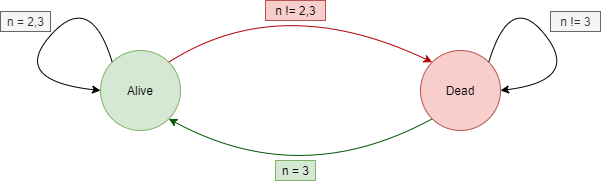

# Conway's Game of Life

## Instructions
1. Install dependencies - *Numpy*, *Matplotlib*   
`python3 -m pip install -r requirements.txt`
2. Start the game   
 `python3 gameOfLife.py`

## Game Parameters
You can adjust the following parameters in the [code](gameOfLife.py) 
1. Size of the planet (*N*) 
2. Probability of life on the planet (*p*)
3. Animation interval (*interval*)

## Analysis
1. Time complexity **O**(*N*2)
2. Space complexity **O**(*N*2)

>[Preetam Pinnada](https://preetam25.github.io)